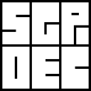

[](https://github.com/gap-packages/sgpdec/actions?query=workflow%3ACI+branch%3Amaster)
[](https://codecov.io/gh/gap-packages/sgpdec)


# SgpDec: Hierarchical Composition and Decomposition of Permutation Groups and Transformation Semigroups

## What is it good for?
SgpDec is a computational implementation of [Krohn-Rhodes theory](https://en.wikipedia.org/wiki/Krohn%E2%80%93Rhodes_theory). It is capable of decomposing transformation semigroups and permutation groups into simpler components, or composing simple components into complex structures. The building blocks are put together in a cascade product, which is an efficiently constructed subsemigroup of the wreath product of the components. The hierarchical nature of the cascade product allows us to build successive approximations of finite computational structures.

There is an excellent [video introduction to Krohn-Rhodes theory by Simon DeDeo](https://www.youtube.com/playlist?list=PLWpny35W2zZPr6COsyOD-PujR-_bWMjUk), a unit of [an online course on renormalization](https://www.complexityexplorer.org/tutorials/67-introduction-to-renormalization). Throwing away information selectively in order to understand complex systems is a fundamental idea for SgpDec as well.

The package is used for SYDE 710 (Topics in Mathematics) Algebraic Structures of Discrete Dynamical Systems, a graduate course at the [Systems Design Engineering](https://uwaterloo.ca/systems-design-engineering/) department of University of Waterloo.

For more on computational semigroup theory check this [computational semigroup theory blog (outdated)](https://compsemi.wordpress.com/).

## How to use it?

You need the latest version of the [GAP computer algebra system](https://www.gap-system.org/). Installing SgpDec is merely extracting the [latest release's archive](https://github.com/gap-packages/sgpdec/releases) into the ```pkg``` folder of GAP. Then the command `LoadPackage("SgpDec");` loads the package into the GAP system.

To get some idea what can be computed with SgpDec, check this paper: [SgpDec: Cascade (De)Compositions of Finite Transformation Semigroups and Permutation Groups](http://link.springer.com/chapter/10.1007/978-3-662-44199-2_13), [preprint](https://arxiv.org/abs/1501.03217). For further details the documentation should be helpful. It can be generated by the `SgpDecMakeDoc()` command, and the resulting files (HTML, PDF) can be found in the `doc` folder.

For implementational details, the preprint [Cascade product of permutation groups](https://arxiv.org/abs/1303.0091) describes the cascade product (explicitly constructed substructures of the wreath product), and the [Computational Holonomy Decomposition of Transformation Semigroups](https://arxiv.org/abs/1508.06345) contains a constructive proof of the holonomy decomposition, which is in close correspondence to the implementation (work in progress).

## Where to complain when something goes wrong?

Please report any problem or request features by [creating on issue on the project page](https://github.com/gap-packages/sgpdec/issues).

## Who are you?
WEB | Twitter
----|-----------

[Attila Egri-Nagy](http://www.egri-nagy.hu) | [@EgriNagy](https://twitter.com/EgriNagy)
[James D. Mitchell](https://jdbm.me/) | [@jdmjdmjdmjdm](https://twitter.com/jdmjdmjdmjdm)
[Chrystopher L. Nehaniv](https://uwaterloo.ca/systems-design-engineering/profile/cnehaniv) | [@NehanivCL](https://twitter.com/NehanivCL)
